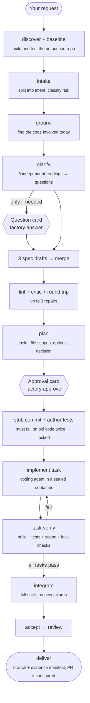

# AI Factory

> Turn a plain-English change request into a **verified pull request** on a real .NET + Postgres codebase, with every step checked by code, not by the AI's word.


AI Factory is a command-line tool. You type what you want changed. It asks you only the questions that matter, writes a spec, plans the work, and asks you to approve. Then it writes the tests first, implements the change, runs every check itself in sealed containers, and hands you a branch (or a PR) with the evidence attached.

```bash
factory start "Return 404 instead of 500 when an order ID doesn't exist" --project shop-api
```

---

## Contents

- [Why](#why)
- [How it works](#how-it-works)
- [What's built / what isn't](#whats-built--whats-not)
- [Requirements](#requirements)
- [Installation](#installation)
- [Configure a project](#configure-a-project)
- [Your first run](#your-first-run)
- [Command reference](#command-reference)
- [Safety model](#safety-model)
- [Troubleshooting](#troubleshooting)
- [Project layout](#project-layout)
- [Development](#development)
- [Design docs](#design-docs)

---

## Why

Coding agents are good at writing code and bad at proving it's right. They can say "all tests pass" when they didn't run, skip a failing test, or quietly change the test instead of the code. AI Factory puts the agent inside a pipeline where:

- **Plain code decides, not a model.** Every step ends at a gate (a small, deterministic check). The same inputs always give the same decision.
- **The factory runs the checks itself.** Build and tests run in throwaway containers the AI can't touch; the factory reads the results.
- **Tests come first and get locked.** Acceptance tests are written from the spec, must fail on today's code, and are then locked by fingerprint. The implementer can't edit them.
- **Humans decide on a terminal.** Approvals are tied to the exact plan you saw. Change the plan and the approval no longer counts.
- **Everything is recorded.** Each run keeps an append-only ledger, and `factory verify-evidence` re-checks every decision later.

---

## How it works



**The steps in plain words**

| Step | What happens | Who does it |
|---|---|---|
| discover | Builds and tests the untouched repo once and remembers the result, so the run is only blamed for *new* failures. Refuses repos it can't handle yet. | Factory (no AI) |
| intake | Splits your request into short "intent" quotes, classifies it (bugfix/feature…) and its risk. | AI (Haiku) |
| ground | Finds the files and methods involved today, quoting them. Quotes are checked against the real files. | AI (Opus) |
| clarify | Three AIs read your request independently. Where they **disagree**, that's ambiguity. You get at most 5 questions (then at most 3 more); everything else becomes a written assumption. | AI + you |
| specify | Three independent spec drafts (EARS requirements + Given/When/Then tests) are merged. Code checks the format; a critic looks for gaps; a round-trip check restates the spec and compares it to your words. | AI + code |
| plan | Tasks with exact file scopes, at least two options and a short decision record. | AI (Opus) |
| **approval** | One card with your request word for word, the answers, the requirements, every file the plan will touch and the critic's findings. | **You** |
| author tests | A coding agent writes one test per acceptance criterion. The factory runs them on the old code **twice**; they must fail for the right reason. Then they're locked. | AI + factory |
| implement ⟲ verify | A coding agent works on one task at a time in a sealed container. The factory then builds, runs the tests, and checks the change stayed in scope, didn't touch locked tests, added no skips or secrets. Failures loop back with the exact errors. | AI + factory |
| integrate / accept | Full test suite; every locked test must have run and passed; no new failures vs the baseline. | Factory |
| review | A reviewer (a different model family when an OpenAI key is set) reads the diff. Whether a finding blocks is decided by code. | AI + code |
| deliver | Secret scan of every commit, an evidence manifest commit, and a PR (or a local branch). | Factory |

When something keeps failing, the factory climbs a fixed ladder (retry with the errors → more effort → stronger model) and then **parks** the run for you. Hard limits on attempts, spend and time stop runaway runs; `factory status <run>` shows the running cost.

---

## What's built / what's not

| Built | Not yet |
|---|---|
| Brownfield mode on **.NET + Postgres** repos | Greenfield and estimate modes |
| Clarify, 3-draft spec, merge, lint, critic, round trip | Accept that boots the app and records HTTP/DB evidence (today: "the locked test passed") |
| Plan + approval card, stub commit, locked tests | Applying `steer` changes mid-run (recorded, not applied) |
| Claude coding agent in a sealed container | Codex and jcode runners; Next.js/Node repos |
| Test lab: restore → offline build → tests next to a throwaway Postgres | Review repair loop (blocking findings park the run); unlock card for a wrong test |
| Ledger, crash-resume, failure ladder, cost caps, verify-evidence | URL-prefix package filter (today: allowlist by host name) |
| GitHub PR delivery (optional) | Bitbucket PR delivery (today: branch ready locally) |

**Refused for now:** SQL Server, repos whose tests start their own containers (Testcontainers), Windows-only projects (WPF/WinForms/.NET Framework), Git LFS, submodules.

---

## Requirements

| | Version | Notes |
|---|---|---|
| OS | Linux, or **Windows 10/11 with WSL2 + Ubuntu** | The factory refuses to run on `C:\` paths (`/mnt/c/...`). |
| Node.js | **22+** | Install with nvm. |
| Git | any recent | |
| Docker | **Docker Engine CE inside Ubuntu** | Not Docker Desktop (licensing). Podman also works. |
| API key | Anthropic (required), OpenAI (optional) | Pay-as-you-go API credits. A Claude Pro/Max subscription is **not** an API key. |
| Disk | ~10 GB free | .NET SDK and Postgres images, package caches. |

---

## Installation

> Windows users: do **every** step below inside the **Ubuntu** terminal (the prompt looks like `you@machine:~$`), not PowerShell.

### 1. WSL2 + Ubuntu (Windows only)

In PowerShell **as administrator**:

```powershell
wsl --install -d Ubuntu
```

Restart, open **Ubuntu** from the Start menu, and create your Linux user. Make sure systemd is on:

```bash
cat /etc/wsl.conf        # should contain: [boot] systemd=true
```

If it doesn't, add it (`sudo nano /etc/wsl.conf`), then run `wsl --shutdown` in PowerShell and reopen Ubuntu.

### 2. Node.js 22 (via nvm)

```bash
curl -o- https://raw.githubusercontent.com/nvm-sh/nvm/v0.40.3/install.sh | bash
source ~/.bashrc
nvm install 22
node -v                  # v22.x
```

### 3. Docker Engine inside Ubuntu

```bash
sudo apt-get update && sudo apt-get install -y ca-certificates curl
sudo install -m 0755 -d /etc/apt/keyrings
sudo curl -fsSL https://download.docker.com/linux/ubuntu/gpg -o /etc/apt/keyrings/docker.asc
echo "deb [arch=$(dpkg --print-architecture) signed-by=/etc/apt/keyrings/docker.asc] https://download.docker.com/linux/ubuntu $(. /etc/os-release && echo $VERSION_CODENAME) stable" | sudo tee /etc/apt/sources.list.d/docker.list
sudo apt-get update && sudo apt-get install -y docker-ce docker-ce-cli containerd.io
sudo usermod -aG docker $USER
```

Then in PowerShell run `wsl --shutdown`, reopen Ubuntu and check:

```bash
which docker             # must be /usr/bin/docker
docker run --rm hello-world
```

> If `which docker` shows a `/mnt/c/.../DockerDesktop/...` path, open Docker Desktop → **Settings → Resources → WSL integration** and untick Ubuntu (or quit Docker Desktop).

### 4. Get the factory

```bash
mkdir -p ~/code && cd ~/code
git clone https://github.com/im-ahsan/ai-factory.git
cd ai-factory
npm install
npm run build
npm link                 # installs the `factory` command
factory --help
```

> Don't want `npm link`? Use `npm run factory -- <command>` from inside the folder instead of `factory <command>`.

### 5. Your secrets file

Create it yourself. **Never paste keys into chat, tickets or the repo.**

```bash
mkdir -p ~/.factory && chmod 700 ~/.factory
nano ~/.factory/.env
```

```ini
# ~/.factory/.env
ANTHROPIC_API_KEY=sk-ant-...
# OPENAI_API_KEY=sk-...        # optional: critic and review use a second model family
# SHOP_TEST_DB_PASSWORD=       # only if your repo's tests hardcode a DB password (see below)
```

```bash
chmod 600 ~/.factory/.env
```

Get an Anthropic key at [console.anthropic.com](https://console.anthropic.com) → **API Keys** (add credit under **Billing** first; set a monthly limit under **Limits**). If you sign in with a company email you may need your organisation admin to approve you.

### 6. Check everything

```bash
factory doctor
```

```
ok   Node v22.x
ok   running inside Linux (WSL2), not on a Windows drive
ok   container runtime: /usr/bin/docker
ok   ~/.factory/.env exists
ok   ANTHROPIC_API_KEY set in ~/.factory/.env
note OPENAI_API_KEY not set: critic and review will use Claude (single family)
ok   projects: shop-api.yaml
```

---

## Configure a project

### 1. Put the target repo inside Linux

The factory works on a local git clone inside Ubuntu, never on `C:\`. If the repo is already on your Windows drive, a local clone is enough (no network, no credentials):

```bash
git clone --branch main /mnt/c/Users/<you>/source/repos/shop-api ~/code/shop-api
```

### 2. Write `~/.factory/projects/<name>.yaml`

Start from [`docs/project-example.yaml`](docs/project-example.yaml). No secrets go in this file, only the **names** of variables in `~/.factory/.env`.

```yaml
project: shop-api                           # the name you pass to --project
repo: /home/<you>/code/shop-api             # inside Linux
baseBranch: main
stack: dotnet
dotnet:
  sdkImage: mcr.microsoft.com/dotnet/sdk:8.0   # match the repo's target framework
  solution: ShopApi.sln
  testTimeoutSec: 2400
database:                                    # a throwaway Postgres for the tests
  image: postgres:16-alpine
  name: ShopTestDb                           # the database your tests expect
  user: postgres                             # the login your tests use (created WITHOUT superuser)
  passwordEnv: SHOP_TEST_DB_PASSWORD         # its password, stored in ~/.factory/.env
  producerEnv:                               # settings only the test container receives
    ConnectionStrings__DefaultConnection: "Host={{DB_HOST}};Port={{DB_PORT}};Database={{DB_NAME}};Username={{DB_USER}};Password={{DB_PASSWORD}}"
agentEnv:                                    # dummy values where the AI works
  ConnectionStrings__DefaultConnection: "Host=localhost;Database=dummy;Username=dummy;Password=dummy"
noGo:                                        # paths the AI never sees
  - "web/**"                                 # e.g. a frontend folder the backend change shouldn't touch
# forge: { kind: github, repo: owner/name, tokenEnv: GITHUB_TOKEN }   # add only when you want real PRs
```

| Field | Meaning |
|---|---|
| `database.user` / `passwordEnv` | Use when your tests hardcode a login (e.g. in a test fixture). Leave out and the factory makes its own. |
| `producerEnv` | Environment for the **test** container only. `{{DB_*}}` are filled in by the factory. |
| `agentEnv` | Dummy environment for the **coding** container, so the app compiles. Never put real secrets here. |
| `noGo` | Globs hidden from every AI step. |
| `dotnet.runnerArgs` | Extra test-runner settings passed on the command line, e.g. `["xUnit.ParallelizeTestCollections=false"]`. |
| `steps` | Override the model per step (advanced; see `src/stages/routing.ts`). |
| `forge` | GitHub repo to push and open PRs. Without it, delivery leaves a ready branch locally. |

### 3. Record the baseline (no AI, no cost)

```bash
factory baseline --project shop-api
```

```
done in 95s: 412 tests, 405 passed, 7 failed, 0 skipped; exit 1; valid=true
```

Tests that already fail are fine: they're remembered, and a run is only blamed for **new** failures. But code covered only by failing tests has no protection, so pick demo changes elsewhere.

---

## Your first run

```bash
factory start "Return 404 instead of 500 when an order ID doesn't exist" --project shop-api
```

The factory works until it needs you, then prints what to do and exits. Nothing runs in the background while it waits.

**1. Questions (only if needed)**

```bash
factory show-card <run>
factory answer <run> <hash> Q-1=A Q-2="only for guest checkouts"
```

Unanswered questions take the recommended option. Low-risk question cards default automatically after 24 hours.

**2. Approval**

```bash
factory show-card <run>        # read the card: request, answers, requirements, files, plan, findings
factory approve <run> <hash> --note "low risk, one controller"
# or
factory reject <run> <hash> --reason "don't change the payments module"
```

`<run>` can be any unique part of the run ID; `<hash>` is the first characters of the card hash printed on the card.

**3. Result**

```bash
factory status <run>
factory show-card <run> --pr   # the PR description the factory wrote
git -C ~/code/<repo> log --oneline <base>..factory/<run>
factory verify-evidence <run>  # re-check every recorded decision
```

The branch `factory/<run>` holds the stub commit (if any), the locked tests, one commit per task and one evidence-manifest commit.

**If a run parks**, `factory status <run>` says why (cap hit, a check failed twice, a locked test keeps failing…). Fix the cause and run `factory resume <run>`, or start a new run.

---

## Command reference

| Command | What it does |
|---|---|
| `factory doctor` | Checks Node, WSL, Docker, secrets and projects. |
| `factory baseline --project <p>` | Builds and tests the untouched repo in the test lab. No AI. |
| `factory start "<request>" --project <p>` | Creates a run and executes until a card, a park or delivery. |
| `factory status [run]` | All recent runs, or one run's steps, cost and open card. |
| `factory show-card <run> [--pr]` | Prints the open card (or the PR text). |
| `factory answer <run> <hash> Q-1=A …` | Answers a question card. Terminal only. |
| `factory approve <run> <hash> [--note]` | Approves the plan. Terminal only. |
| `factory reject <run> <hash> --reason` | Rejects the plan (the run parks). Terminal only. |
| `factory resume <run>` | Continues a run (after a park, crash or restart). |
| `factory pause <run>` / `stop <run>` | Pauses or stops at the next step boundary. |
| `factory steer <run> <file>` | Records a requirement change (applying it isn't built yet). |
| `factory verify-evidence <run>` | Re-runs every gate decision from the ledger. |

Decisions (`answer`, `approve`, `reject`, `steer`) only work from an interactive terminal, so no script, plugin or AI can approve its own plan.

---

## Safety model

| Rule | How it's enforced |
|---|---|
| Your code stays on your machine | Repos live in local clones; only the model APIs you configure receive code. |
| Keys stay out of the AI's reach | Keys live only in `~/.factory/.env`. The coding container talks to a small factory proxy that adds the key; the container never holds it. |
| No internet for the AI | The coding container can reach only the model API through that proxy. Builds and tests run with no network at all. Package restore can reach only allowlisted feeds. |
| Repo code never runs on your host | The factory's own git disables hooks and filters; builds and tests run only in containers. |
| No live secrets where the AI works | Secret files are hidden from AI steps; the coding container gets dummy settings; packs are secret-scanned and redacted. |
| Client agent files don't steer the AI | `CLAUDE.md`, `AGENTS.md`, `.claude/`, `.mcp.json`… are masked in the coding container; loading one fails the step. |
| Tests can't be weakened | Locked by fingerprint; test projects and runner config are protected; every expected test must actually run. |
| Nothing unverified ships | Pushed code = the exact commit the gates judged + one manifest-only commit. |
| Test database is disposable | A fresh Postgres per check, reachable only from the test container, with a non-superuser login. |

---

## Troubleshooting

| Symptom | Fix |
|---|---|
| `No container runtime inside Linux… Docker Desktop, not used` | Install Docker Engine in Ubuntu (step 3) and untick Ubuntu under Docker Desktop's WSL integration. |
| `permission denied … /var/run/docker.sock` | `sudo usermod -aG docker $USER`, then `wsl --shutdown` and reopen Ubuntu. |
| `Path … is on a Windows drive` | Clone the repo into Ubuntu (`~/code/...`) and point `repo:` there. |
| `X is missing in ~/.factory/.env` | Add that variable to `~/.factory/.env`. |
| `The untouched repo doesn't build in the test lab` | Check `dotnet.sdkImage` matches the repo's framework; check private NuGet feeds (not supported yet). |
| Many tests fail in `baseline` | Check whether they fail on your machine too. If yes, they're pre-existing and remembered. If not, compare DB settings (`database:`) and seed data. |
| `Repo is busy: run … is executing` | Only one run executes per repo at a time. Wait, or `factory stop` the other run. |
| A run is `parked` | `factory status <run>` shows why; fix it and `factory resume <run>`. |
| `.env` not visible in VS Code | It's in `~/.factory/`, not the project. `code ~/.factory/.env`. |

Everything a run did is in `~/.factory/ledger/<run>/` (`events.jsonl` plus content-addressed artifacts and cards).

---

## Project layout

```
ai-factory/
├── src/
│   ├── contracts/   zod schemas: artifacts, ledger events, packs, test results
│   ├── ledger/      run manager: append-only ledger, locks, replay, caps, hardened git
│   ├── gates/       gate engine: pure checks, lock set, failure ladder, policy merge
│   ├── verify/      test lab: container runtime, .NET producer, TRX parsing
│   ├── context/     context builder: snapshot, read-only tools, repo map, redaction
│   ├── runners/     model runners: own read-only loop (API), Claude agent in a container, proxy
│   ├── stages/      the pipeline steps and the executor
│   ├── config/      project config and secrets loading
│   └── cli/         the `factory` command
├── docker/
│   ├── agent/       the coding container image (.NET SDK + Node + Claude Agent SDK)
│   └── proxy/       the egress proxy (adds API keys, allowlists package feeds)
└── docs/
    ├── design/      the design documents
    └── project-example.yaml
```

Factory data lives outside the repo, in `~/.factory/`:

```
~/.factory/
├── .env             your secrets (you create it)
├── projects/        one YAML per target repo
├── ledger/<run>/    the evidence for each run
├── repos/<project>/ remembered baselines
├── wt/              git worktrees of running runs
└── tmp/             per-run package caches
```

---

## Development

```bash
npm test             # all tests, offline: no model calls, no Docker needed
npm run typecheck
npm run build
```

- TypeScript (strict, ESM), Node 22, zod 4 as the single schema source, vitest.
- `src/stages/e2e.test.ts` runs the whole pipeline with a scripted model and a fake container runtime. Start there to understand the flow.
- Keep commits small; every module has tests next to it (`*.test.ts`).

## Design docs

Start with [`docs/design/BUILD-BRIEF.md`](docs/design/BUILD-BRIEF.md), then [`docs/design/stages-aligned.md`](docs/design/stages-aligned.md) (the source of truth for stages). Component designs: run manager, gate engine, verify runner, context builder, adapters.

---

**Status:** experimental proof of concept. Use it on repos and branches where a wrong change costs nothing, read every approval card, and review every PR before merging.
